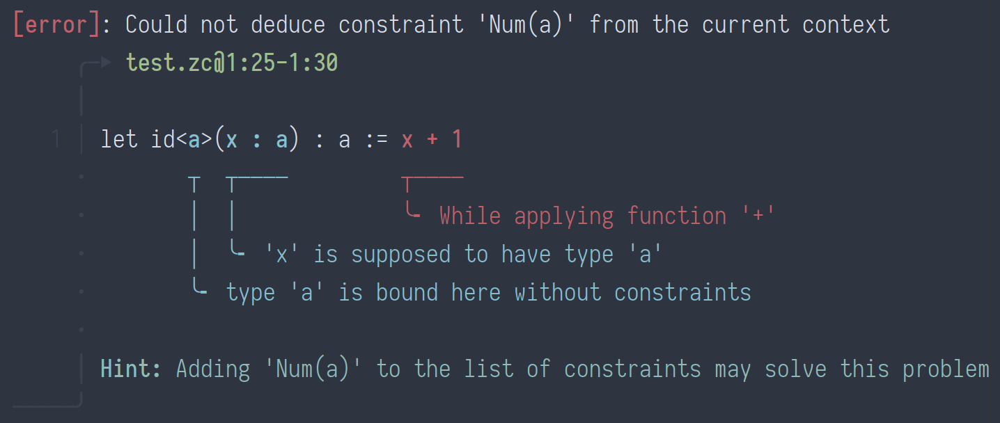

# Diagnose4J

This is a port of my original Haskell library [Diagnose](https://github.com/mesabloo/diagnose),
which is an error-reporting library.
The basic goal is to format errors beautifully while still keeping the easiness of generating them.

Here is an example of what it produces (in the IntelliJ console¹):

⁽¹⁾: Lines are disconnected. 
This is because IntelliJ spaces characters so much.
This should not be the case in most terminals or when outputting as text.